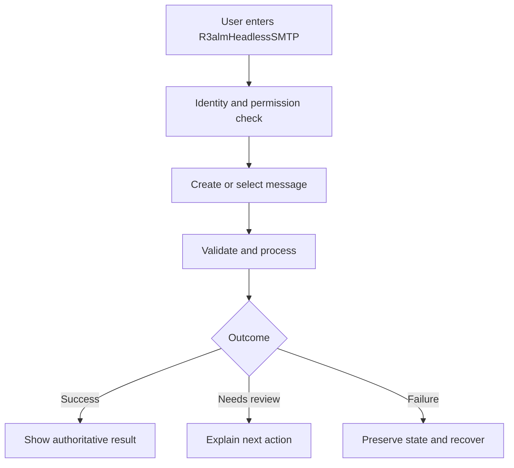

# User Flows

> R3almHeadlessSMTP · Platform · Pre-Alpha

R3almHeadlessSMTP is cataloged as a Platform application focused on email and messaging operations.

> **Baseline notice:** This document defines the expected operating standard. It does not claim that a control, integration, model, or certification is already implemented; verify the code, configuration, and production evidence before release.

## Primary flow

## Flow requirements

At each step, show identity context where relevant, current state, required input, validation, progress for long work, safe cancellation, and the next action. Confirm irreversible or externally visible actions immediately before execution.

## Alternate paths

- Unauthenticated or expired session: preserve non-sensitive context and return through authentication.
- Unauthorized action: disclose no protected data; explain how to request access.
- Invalid input: identify the field and rule without exposing internals.
- Duplicate request: return the original authoritative result when idempotency permits.
- Dependency unavailable: show degraded status, avoid false success, and retry safely.
- Review required: record reviewer, reason, evidence, and decision.
- User exits: save only approved draft state and explain retention.

## Accessibility and trust

Use semantic structure, keyboard access, visible focus, descriptive errors, sufficient contrast, reduced-motion support, and plain-language status. Automated or inferred outputs must be labeled with appropriate uncertainty and review options.
